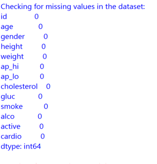
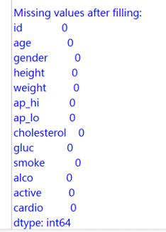
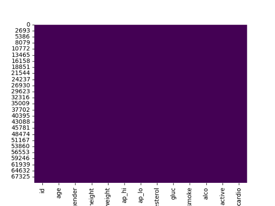
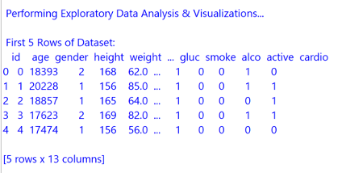
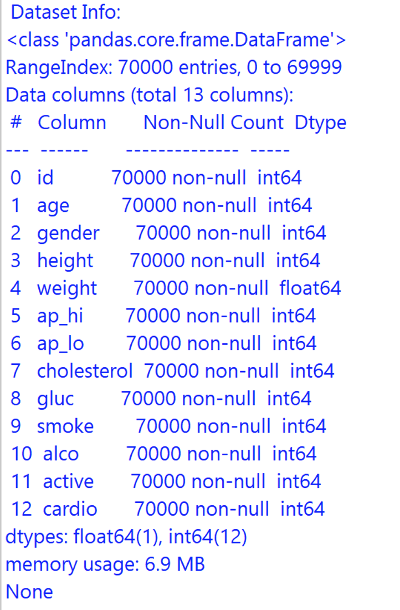
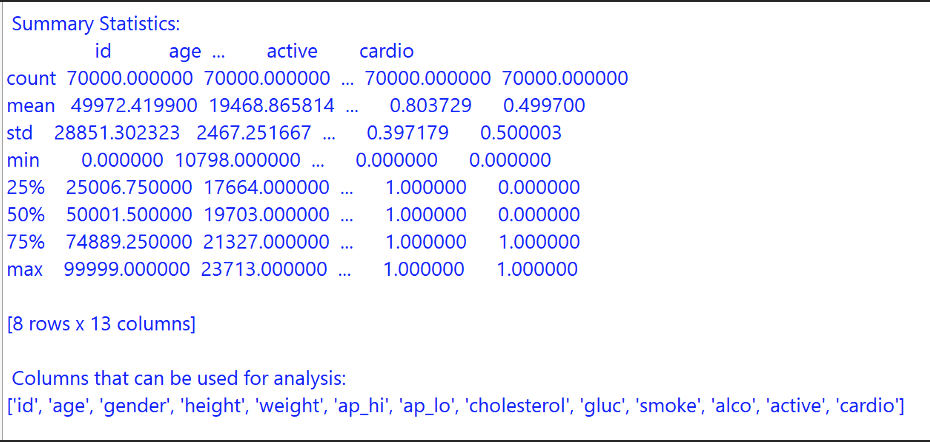
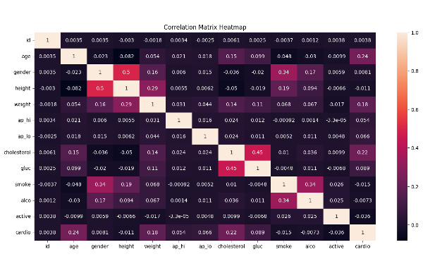
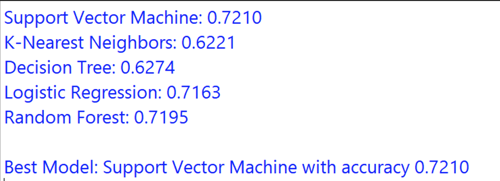

# Cardiovascular Disease Prediction AI Model

---

This project analyzes heart disease prediction by performing data preprocessing, exploratory data analysis with visualizations, and correlation analysis. It evaluates machine learning models like SVM, KNN, Decision Trees, Logistic Regression, and Random Forest to determine the most accurate model for prediction.

---

## Data Preprocessing

**Before Preprocessing:**  

**After Preprocessing:**  

**Data Processing:**  

---

## Pairplots and Data Visualizing to find meaningful insights

  
  
  

---

## Confusion Matrix

---

## Checking the accuracy of all the models and selecting the best model

